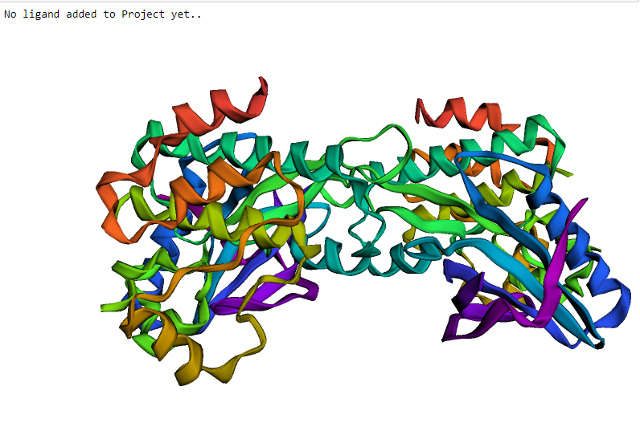
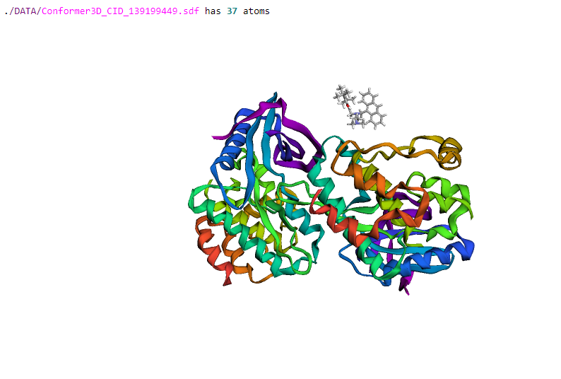
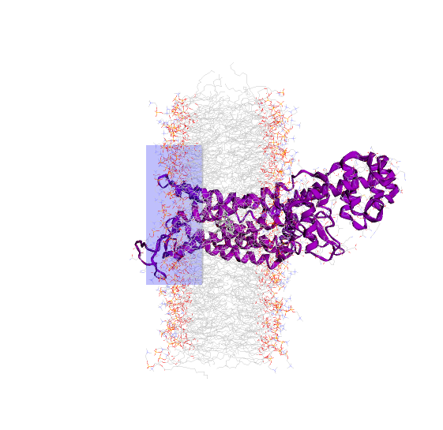
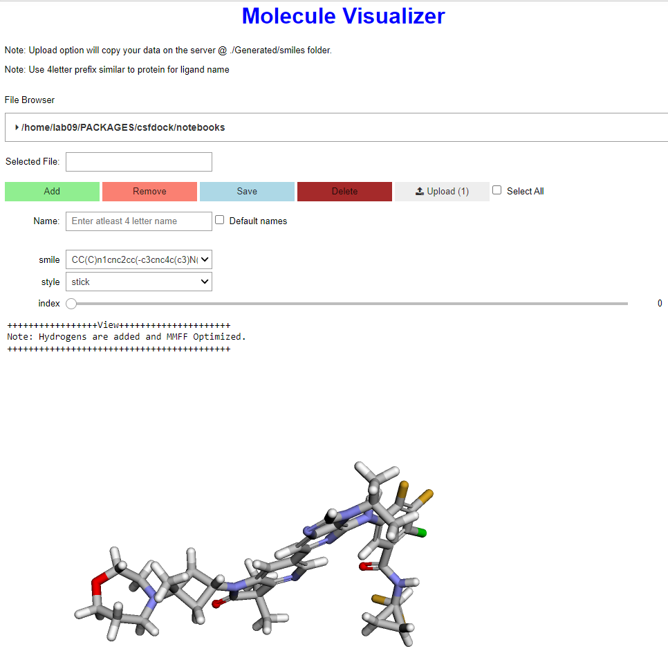

CsfDock
=======

|PyPI| |Status| |Python Version| |License|

|Read the Docs| |Tests| |Codecov|

|pre-commit| |Black|

.. |PyPI| image:: https://img.shields.io/pypi/v/csfdock.svg
   :target: https://pypi.org/project/csfdock/
   :alt: PyPI
.. |Status| image:: https://img.shields.io/pypi/status/csfdock.svg
   :target: https://pypi.org/project/csfdock/
   :alt: Status
.. |Python Version| image:: https://img.shields.io/pypi/pyversions/csfdock
   :target: https://pypi.org/project/csfdock
   :alt: Python Version
.. |License| image:: https://img.shields.io/pypi/l/csfdock
   :target: https://opensource.org/licenses/MIT
   :alt: License
.. |Read the Docs| image:: https://img.shields.io/readthedocs/csfdock/latest.svg?label=Read%20the%20Docs
   :target: https://csfdock.readthedocs.io/
   :alt: Read the documentation at https://csfdock.readthedocs.io/
.. |Tests| image:: https://github.com/takshan/csfdock/workflows/Tests/badge.svg
   :target: https://github.com/takshan/csfdock/actions?workflow=Tests
   :alt: Tests
.. |Codecov| image:: https://codecov.io/gh/takshan/csfdock/branch/main/graph/badge.svg?token=B1J6NTBH4P
   :target: https://codecov.io/gh/takshan/csfdock
   :alt: Codecov
.. |pre-commit| image:: https://img.shields.io/badge/pre--commit-enabled-brightgreen?logo=pre-commit&logoColor=white
   :target: https://github.com/pre-commit/pre-commit
   :alt: pre-commit
.. |Black| image:: https://img.shields.io/badge/code%20style-black-000000.svg
   :target: https://github.com/psf/black
   :alt: Black

A simple package for making custome scoring function in smina, visulaization of molecules, ligand and memebrane using py3dmol.

An implementation of regression for optimizing scoring function and $\alpha$ and $\beta$ from experimental data.

Features
--------

* Visualize Receptor, lipids and ligands 
* Automate docking using  smina                                
* Calculate RMSD and plot RMSD Matrix                                 
* Develop Custom Scoring Functions
* Optimize $\alpha$ and $\beta$
* and many more..

Requirements
------------

* TODO

Installation
------------

You can install *CsfDock* via pip_ from PyPI_:

.. code:: console

   $ pip install csfdock

Usage
-----

::

    from csfdock.ar2a_v3 import *

Create an Object of the ProjectStart:

::

    a2 = ProjectStart() 

Can set your project directory as follow which may not be same as the
runing notebook.Creates a relative paths for files inside the project
directory

::

    a2.SetFolders(".") 

Adding a receptor into the project is as easy as following:

::

    a2.LoadReceptor("membrane")
    a2.SimpleView

Similarly for Ligand as well

::

    a2.LoadLigand("./DATA/Conformer3D_CID_139199449.sdf") 

|Image of csfdock4| 

For docking visualization of grid box around active
site is important. Here we can just give an input to create a grid and
visualize it.

::

    a2.LoadBox([7.623, 3.103, -18.483], [30.0, 50, 20]) 

Whole view of the molecules loaded into the project instance can be
visualize as following:

::

    a2.ShowMolecules() 

|Image of csfdock2| 

View the detail information of the project instace
using print() method on the instance variable.

::

    print(a2)

|Image of csfdock0|

::

    a2.display()

Visualize smiles code and generate 3D structures.

|Image of csfdock6|

::

    df =rmsd_matrix(poses,verbose=False, plot=True, save=True, annot=True, key="latest_calculation")

View the RMSDs of the ligands docked in matrix view.

|Image of csfdock5|

.. |Image of csfdock0| image:: ./images/csfdock0.png
.. |Image of csfdock5| image:: ./images/csfdock5.png

Please see the `Command-line Reference <Usage_>`_ for details.

Contributing
------------

Contributions are very welcome.
To learn more, see the `Contributor Guide`_.

License
-------

Distributed under the terms of the `MIT license`_,
*CsfDock* is free and open source software.

Issues
------

If you encounter any problems,
please `file an issue`_ along with a detailed description.

.. _Cookiecutter: https://github.com/audreyr/cookiecutter
.. _MIT license: https://opensource.org/licenses/MIT
.. _PyPI: https://pypi.org/
.. _file an issue: https://github.com/takshan/csfdock/issues
.. _pip: https://pip.pypa.io/
.. github-only
.. _Contributor Guide: CONTRIBUTING.rst
.. _Usage: https://csfdock.readthedocs.io/en/latest/usage.html
